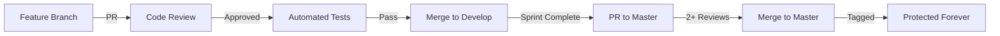

# Code Protection & Refactoring Policy

## Purpose
Once code is committed to master and published, it becomes **protected**. This policy ensures stability, backward compatibility, and maintainability.

## Protection Levels

### 🔴 Level 1: IMMUTABLE (Never Change)
Code that **CANNOT** be modified after release:
- Published API contracts
- Database migration files
- Authentication/Authorization core
- Cryptographic implementations
- Payment processing logic

**Enforcement**: These files are tagged with `@immutable` and any modification is blocked.

### 🟡 Level 2: PROTECTED (Refactor Only)
Code that can only be modified through refactoring:
- Core business logic
- Published npm packages
- Configuration schemas
- Public interfaces
- Event handlers

**Rules for Modification**:
1. Create `refactor/[component]` branch
2. Maintain **exact** same interface
3. All existing tests must pass
4. Add new tests for changes
5. Requires 2+ reviewers
6. Performance must not degrade

### 🟢 Level 3: MAINTAINABLE (Bug Fixes Allowed)
Code that can be fixed but not redesigned:
- UI components
- Internal utilities
- Non-critical algorithms
- Documentation
- Tests

**Rules for Fixes**:
1. Create `fix/[issue-id]` branch
2. Minimal change principle
3. Add regression test
4. Document in CHANGELOG
5. Single reviewer required

## Refactoring Protocol

### When to Refactor (Allowed)
✅ **Performance Improvement**
```typescript
// BEFORE (Protected)
function slowSort(arr: number[]): number[] {
  // O(n²) implementation
  return bubbleSort(arr);
}

// AFTER (Refactored)
function slowSort(arr: number[]): number[] {
  // O(n log n) - Same interface, better performance
  return quickSort(arr);
}
```

✅ **Code Clarity**
```typescript
// BEFORE (Protected)
function calc(x: number, y: number): number {
  return x * 1.1 + y * 0.9; // Magic numbers
}

// AFTER (Refactored)
function calc(x: number, y: number): number {
  const WEIGHT_X = 1.1;
  const WEIGHT_Y = 0.9;
  return x * WEIGHT_X + y * WEIGHT_Y;
}
```

✅ **Dependency Updates**
```typescript
// BEFORE (Protected)
import oldLibrary from 'old-lib';

// AFTER (Refactored)
import newLibrary from 'new-lib'; // Compatible API
```

### When NOT to Refactor (Forbidden)
❌ **Interface Changes**
```typescript
// FORBIDDEN - Changes interface
function getUserById(id: number) → function getUser(id: string)
```

❌ **Behavior Changes**
```typescript
// FORBIDDEN - Changes behavior
function calculate(x) { return x * 2; } → function calculate(x) { return x * 3; }
```

❌ **Breaking Dependencies**
```typescript
// FORBIDDEN - Breaks consumers
export class OldName → export class NewName
```

## New Feature Protocol

### Adding Features (The Right Way)

✅ **Extend, Don't Modify**
```typescript
// PROTECTED (Don't touch)
class UserService {
  getUser(id: string) { /* existing */ }
}

// NEW (Add alongside)
class UserServiceV2 extends UserService {
  getUserWithRoles(id: string) { /* new feature */ }
}
```

✅ **Composition Over Modification**
```typescript
// PROTECTED (Don't touch)
function processPayment(amount: number) { /* existing */ }

// NEW (Compose with existing)
function processPaymentWithTax(amount: number) {
  const tax = calculateTax(amount);
  return processPayment(amount + tax);
}
```

✅ **Feature Flags**
```typescript
// PROTECTED (Original flow)
function handleRequest(req: Request) {
  if (featureFlags.useNewFlow) {
    return newHandler(req); // NEW
  }
  return originalHandler(req); // PROTECTED
}
```

## Git Branch Enforcement

### Branch Naming Rules
```bash
# For new features (new code only)
feature/[epic]/[name]

# For refactoring (interface preserved)
refactor/[component]/[improvement]

# For bug fixes (minimal changes)
fix/[issue-id]/[description]

# For security patches (critical only)
security/[CVE-id]/[patch]

# FORBIDDEN on master
master ← NO direct commits
main ← NO direct commits
```

### Protection Workflow


## Protected Files (v0.16.7 Lock-down)

**Locked:** 2025-11-07 (PROTECT-001 stabilization)
**Manual Test:** v0.16.7 passing features

### Core Extension (@protected)
- `vscode-lumina/src/extension.ts`
  - Protection Level: @protected (activation, command registration)
  - Tests: Core extension activation, command registration
  - Lock Date: 2025-11-07

### Sprint Management (@protected)
- `vscode-lumina/src/commands/SprintLoader.ts`
  - Protection Level: @protected (TOML parsing, rich fields)
  - Tests: TOML parsing with rich fields (description, why, context, reasoning_chain)
  - Critical Section: parseTomlTasks (lines 504-534)
  - Lock Date: 2025-11-07

### Services (@protected)
- `vscode-lumina/src/commands/AutoTerminalSelector.ts`
  - Protection Level: @protected (terminal integration)
  - Tests: Terminal list/dropdown logic, shell integration monitoring
  - Lock Date: 2025-11-07

- `vscode-lumina/src/services/TaskDependencyValidator.ts`
  - Protection Level: @protected (dependency validation)
  - Tests: Dependency blocking functionality (described as "BRILLIANT!" in test results)
  - Lock Date: 2025-11-07

### Voice Panel (@protected - partial)
- `vscode-lumina/src/commands/voicePanel.ts`
  - Protection Level: @protected (specific sections only)
  - Protected Sections:
    - Terminal list/dropdown logic
    - Sprint dropdown
    - Sprint refresh button
    - Skills browser (Test 5.5)
    - Settings UI (Test 5.6)
  - Lock Date: 2025-11-07
  - **Note:** Other sections (enhance buttons, task starter) have known issues and are NOT protected. See Phase 0b UX Polish tasks for fixes.

### WebView UI (@protected)
- Single unified screen (no tabs) → @protected
- Minimal spacing layout → @protected

**Total:** 5 files locked with @protected annotations
**Historical Precedent:** v0.13.23 native dependency broke extension (9 hours wasted)
**Purpose:** Prevent regression of passing features while building new functionality

---

## Enforcement Mechanisms

**Status:** ✅ ACTIVE (PROTECT-002 complete - 2025-11-07)

### 1. File Annotations (PROTECT-001)

Protection level annotations in code:

```typescript
/**
 * @protected - Core functionality, refactor only
 * Locked: 2025-11-07 (v0.16.7 manual test PASS)
 * Tests: Core extension activation, command registration
 * Reference: PROTECT-001 stabilization (phase-1)
 *
 * Lumina VS Code Extension - Entry Point
 * ...
 */
```

**Annotation format:**
- `@protected`: Refactor only (preserve interface and behavior)
- `@immutable`: Never change (API contracts, external integrations)
- `@maintainable`: Bug fixes allowed (partial implementations)
- Lock date: Date when protection was applied
- Test reference: Manual test that verified functionality
- Status: PASSING/STABLE/PARTIAL

### 2. Pre-commit Hook Enforcement (PROTECT-002)

**Location:** `.git/hooks/pre-commit` (integrated with existing hooks)

**Protection validation script:** `scripts/validate-protection.js`

**How it works:**
1. Hook scans staged files for @protected/@immutable annotations
2. If protected files found, prompts user for approval
3. User must explicitly answer "yes" to proceed
4. If approved, commit succeeds with audit trail message
5. If denied, commit is blocked and files unstaged

**Example enforcement flow:**
```bash
$ git commit -m "Fix bug in SprintLoader"

🔒 Checking code protection...

⚠️  PROTECTED CODE MODIFICATION DETECTED

The following protected files are being modified:

  🟡 PROTECTED: vscode-lumina/src/commands/SprintLoader.ts:10

Protection levels:
  🔴 IMMUTABLE: NEVER modify (API contracts, critical systems)
  🟡 PROTECTED: Refactor only (preserve interface and behavior)

Do you approve modifying protected code? (yes/no): yes

✅ Approval granted

IMPORTANT: Add this to your commit message for audit trail:

PROTECTED CODE MODIFICATION APPROVED:
  - vscode-lumina/src/commands/SprintLoader.ts (protected)
```

**CI Mode:** Skip protection checks in automated environments:
```bash
SKIP_PROTECTION_CHECK=1 git commit -m "Automated update"
```

### 3. Validation Script (scripts/validate-protection.js)

**Features:**
- Scans staged files for protection annotations
- Interactive approval prompts for protected file changes
- Audit trail messages for approved modifications
- Exit codes: 0 (approved/none), 1 (denied), 2 (error)
- CI mode support via SKIP_PROTECTION_CHECK environment variable

**Usage:**
```bash
# Manual validation (used by pre-commit hook)
node scripts/validate-protection.js

# CI mode (skip checks)
SKIP_PROTECTION_CHECK=1 node scripts/validate-protection.js
```

### 4. Protection Audit (scripts/audit-protection.js)

**Status:** Planned (not yet implemented)

**Will provide:**
- Protection coverage reports
- Consistency verification against CODE_PROTECTION_POLICY.md
- Historical protection trends
- Unprotected passing feature detection

**Usage (future):**
```bash
# Generate protection report
node scripts/audit-protection.js --report=summary

# Verify consistency
node scripts/audit-protection.js --verify

# Coverage metrics
node scripts/audit-protection.js --coverage
```

### 4. Code Review Rules
```markdown
## PR Review Checklist

### For Refactor Branches
- [ ] Interface unchanged?
- [ ] All tests pass?
- [ ] Performance same or better?
- [ ] Backward compatible?
- [ ] 2+ reviewers approved?

### For Feature Branches
- [ ] Only new code added?
- [ ] No protected files modified?
- [ ] Tests for new features?
- [ ] Documentation updated?

### For Fix Branches
- [ ] Minimal change?
- [ ] Regression test added?
- [ ] Root cause documented?
- [ ] CHANGELOG updated?
```

## Examples

### Example 1: Adding Voice Feature ✅
```bash
# Correct approach
git checkout -b feature/voice-commands
# Add NEW voice command handler
# Don't modify existing command system
# Create VoiceCommandHandler extends CommandHandler
```

### Example 2: Fixing Performance ✅
```bash
# Correct approach
git checkout -b refactor/database-queries
# Keep same function signatures
# Optimize query implementation
# Ensure all tests pass
```

### Example 3: Fixing Bug ✅
```bash
# Correct approach
git checkout -b fix/AUTH-403/session-timeout
# Minimal change to fix issue
# Add test for the bug case
# Document in CHANGELOG
```

### Example 4: Changing API ❌
```bash
# WRONG - Never do this
git checkout master
# Modify API endpoint directly
# THIS BREAKS CONSUMERS
```

## Migration Strategy

When breaking changes are absolutely necessary:

1. **Version the API**
   - Keep v1 endpoints working
   - Add v2 with new design
   - Deprecate v1 with timeline

2. **Feature Flag Transition**
   - Old code runs by default
   - New code behind flag
   - Gradual rollout
   - Remove old code in major version

3. **Database Migrations**
   - Never modify existing migrations
   - Only add new migrations
   - Support rollback

## Consequences of Violations

### Level 1: Warning
- Modifying protected code in feature branch
- Missing tests for refactor
- No regression test for fix

### Level 2: PR Blocked
- Changing immutable code
- Breaking interface in refactor
- Direct commit to master

### Level 3: Rollback
- Published breaking change
- Failed production tests
- Customer-reported regression

## Success Metrics

- **Zero** breaking changes in patch/minor releases
- **100%** backward compatibility maintained
- **All** refactors pass existing tests
- **Every** fix includes regression test

## Questions?

- Review this policy before any modification
- When in doubt, create new code instead
- Ask team lead for protection level clarification
- See `RELEASE_WORKFLOW.md` for release process